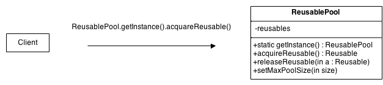

# Object Pool(Creational Pattern)

## Overview
When objects are expensive to create and/or they are needed only for short periods of time it is advantageous to utilize the Object Pool pattern. 

The Object Pool provides a cache for instantiated objects reuse. Cache performs tracking of which objects are in use and which are available. 
If no objects are available then new instances are created. 

## Intent
Object Pool manages a set of instances instead of creating and destroying them on demand.

In this case doing new throughout the code us not just harmful but also expensive.

## UML Diagram

## Code Example

## Mapping the UML classes to Example code

## Points to Remember
Object Pool pattern can be considered when
- The objects are expensive to create.
- You need a large number of short-lived objects, frequent creation of which could cause memory fragmentation.
- Objects are stateless and can be reused.

## Resources
