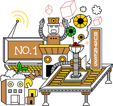

# Creational Patterns

# Overview

These are the patterns that deal with object creation mechanism
- [Abstract Factory](./AbstractFactory)
- [Builder](./Builder)
- [Factory](./Factory)
- [Object Pool](./ObjectPool)
- [Prototype](./Prototype)
- [Singleton](./Singleton)

## Resources
- [https://sourcemaking.com/design_patterns/creational_patterns](https://sourcemaking.com/design_patterns/creational_patterns)
- [https://refactoring.guru/design-patterns/creational-patterns](https://refactoring.guru/design-patterns/creational-patterns)
