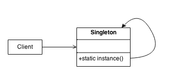

# Singleton (Creational Pattern)
## Overview
The singleton pattern is one of the Gang of Four creational design patterns. 

In software engineering, this is a term that implies a class which can only be instantiated once, and a global point of access to that instance is provided.

## Singleton UML Diagram

## Intent
- Ensure only one instance of a class exists in the system and provide access to it
- Instantiation can either be upfront or delayed till the point of access

## Resourcemanager Example
The Example depicts a simple resource manager designed to be created and accessed as a singleton

The Resources are managed by the InternalResourceManager class and the single instance of this class is managed by the wrapper class ResourceManager.

## Mapping the UML classes to Example code
| **File/Class Name** | **Class Description**  |
| :-----: | :-: |
| [Base.Interfaces/IResourceManager.cs](./Base.Interfaces/IResourceManager.cs)| *Interface of Resource Manager* |
| [ResourceManager/InternalResourceManager.cs](./ResourceManager/InternalResourceManager.cs)| *Class that needs to be created as a singleton*|
| [ResourceManager/ResourceManager.cs](./ResourceManager/ResourceManager.cs)| *Singleton Wrapper class*|
| [AppMain/Program.cs](./AppMain/Program.cs) | *main() function, invoker of singleton* |

## Points to Remember
- Different variations of Singleton implementation are possible. Refer to [this article](https://www.journaldev.com/1377/java-singleton-design-pattern-best-practices-examples) for the details.
- It is good to design the singleton in a form that the singleton can be extended. Keeping the creation and management of single instance separate from the functionality, it becomes easier to extend the functionality by sub classing.
- Remember Singleton is also an [anti-pattern](https://www.michaelsafyan.com/tech/design/patterns/singleton). When you make a design choice to make a class singleton, evaluate the intent and check if it is absolutely necessary.

## Useful Resources
- [https://sourcemaking.com/design_patterns/singleton](https://sourcemaking.com/design_patterns/singleton)
- [https://refactoring.guru/design-patterns/singleton](https://refactoring.guru/design-patterns/singleton)
- [https://sourcemaking.com/design_patterns/singleton](https://www.journaldev.com/1377/java-singleton-design-pattern-best-practices-examples)
- [https://www.michaelsafyan.com/tech/design/patterns/singleton](https://www.michaelsafyan.com/tech/design/patterns/singleton)
